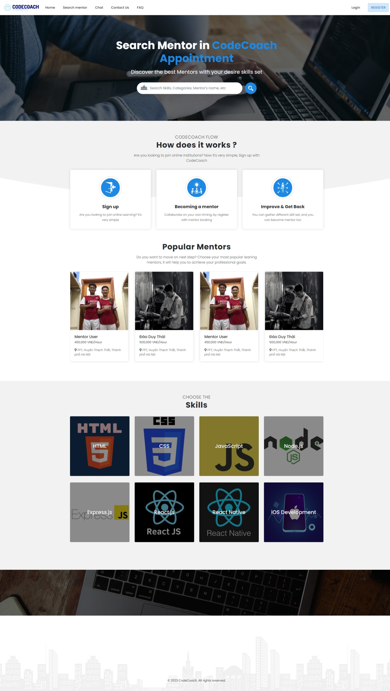
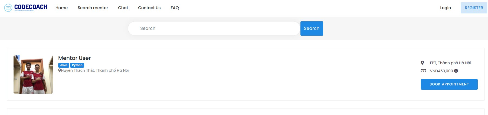
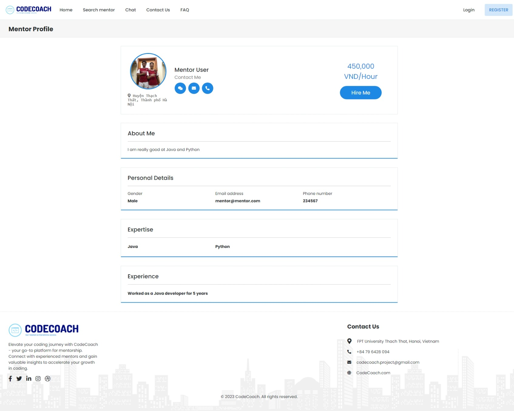
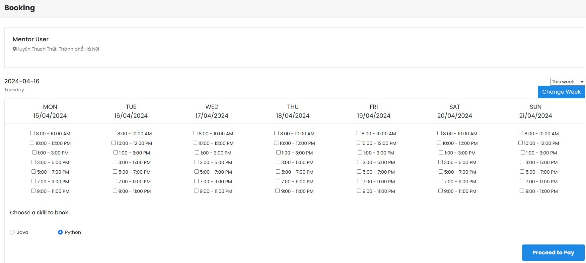
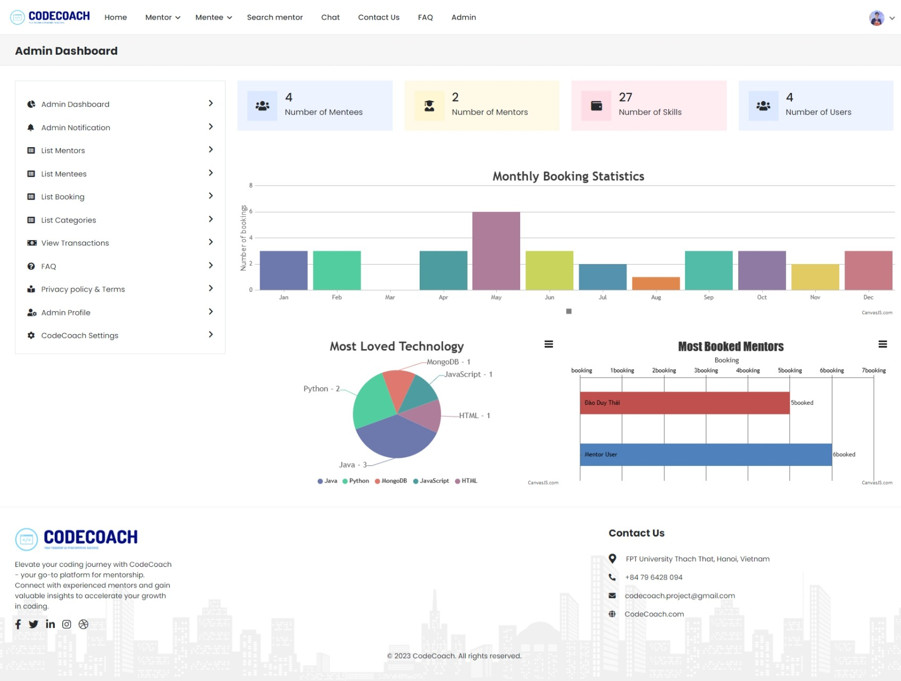
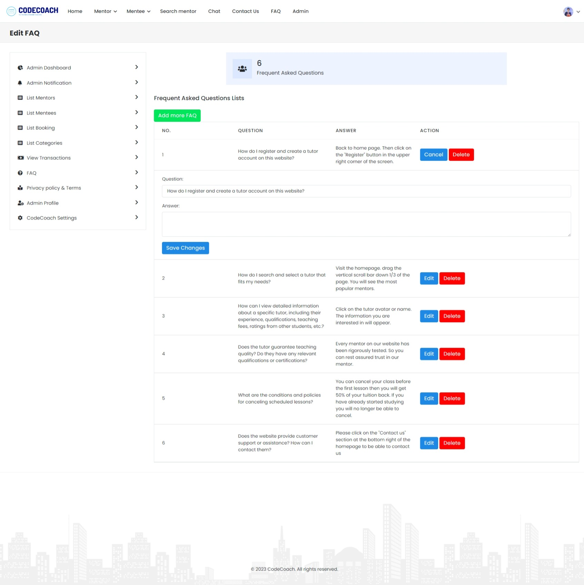

# CodeCoach

CodeCoach is a comprehensive platform for connecting mentors and mentees in the field of programming and coding. This project is built using Java, JSP, SQL Server, JavaScript, Bootstrap, AJAX. This repository contains the source code and necessary files to run the CodeCoach application.

## Screenshots














## Features

1. **User Registration:** Users can create new accounts by providing their basic information and selecting their role as a mentor or mentee.
2. **Login:** Registered users can securely log into their accounts using their credentials.
3. **Home Page:** The home page provides an overview of CodeCoach, featuring popular mentors, search functionality, and skill categories.
4. **Mentor Profiles:** Users can view detailed profiles of mentors, including their expertise, experience, and ratings from previous mentees.
5. **Search Mentors:** Mentees can search for mentors based on specific criteria, such as programming languages, expertise, or availability.
6. **Booking:** Mentees can book mentoring sessions with their chosen mentors, selecting the preferred date, time, and session duration.
7. **Notifications:** Users receive notifications about booking requests, session confirmations, and other important updates.
8. **Messaging:** Mentees and mentors can communicate with each other through chat, voice calls, and video calls within the CodeCoach platform.
9. **Payments:** The system facilitates secure online payments for mentoring sessions using popular payment gateways.
10. **Reviews and Ratings:** After each mentoring session, mentees can provide feedback and ratings for their mentors, helping others make informed choices.
11. **Account Settings:** Users can manage their account details, update their profile information, and configure notification preferences.
13. **Statistics Monitoring:** Admin can manage the traffics and transactions of the entire system.
12. **Website Settings:** Admin can modify the logo, FAQ, About, Header, Footer without having to code.

## Installation

To run CodeCoach locally, please ensure that you have the following prerequisites installed on your system:

- SQL Server (2019 or above)
- Netbeans (I'm using 13 Version and I tried with 17 version but it fails serveral times)
- JDK (1.8)
- Tomcat 8
Follow the steps below to set up the project:

1. **Clone the repository:**

    ```bash
    git clone https://github.com/DuyThaiddt/CodeCoach
    ```

2. **Open Netbeans:**
Configure Sass compiler. I'm using choco to install sass and it works flawlessly.

3. **Configure the database directory in the Source Packages/dal/DBContext.java**


4. **Add sample database**
Go the database folder. Using SQL Server, run `1.createTables.sql`, `2.Trigger.sql`, `3.TinhThanhPho.sql`, and `4.addData.sql` sequentially.

5. **Configure Tomcat. Then build and deploy**


## Contributing

Contributions to CodeCoach are always welcome. If you would like to contribute, please follow these steps:

1. **Fork the repository.**
2. **Create a new branch:**

    ```bash
    git checkout -b my-new-feature
    ```

3. **Make your changes and commit them:**

    ```bash
    git commit -m "Add some feature"
    ```

4. **Push to the branch:**

    ```bash
    git push origin my-new-feature
    ```

5. **Open a pull request and provide a detailed description of your changes.**

Please make sure to adhere to the code style and conventions used in the project.
## Acknowledgements

CodeCoach makes use of the following open-source libraries and APIs:

- jakarta.mail-1.6.7.jar
- jakarta.servlet.jsp.jstl-2.0.0.jar
- jakarta.servlet.jsp.jstl-api-2.0.0.jar
- sqljdbc42.jar
- canvas.js
- ajax

Special thanks to the developers and contributors of these projects for their valuable work.


## License

The CodeCoach is licensed under the [MIT License.](https://choosealicense.com/licenses/mit/)
## Contact

If you have any questions, suggestions, or feedback, please feel free to contact the project maintainer at:

[](https://portfolio.codewithdt.com/)
[](https://www.linkedin.com/in/dduythai/)
[](https://www.youtube.com/@codewithdt)
[](https://www.facebook.com/duythai.ddt/)
[](https://www.instagram.com/dduy_thai/)
[](https://twitter.com/codewithdt)

 
